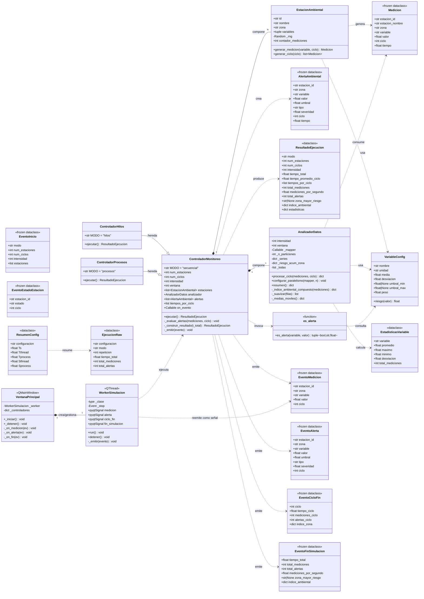
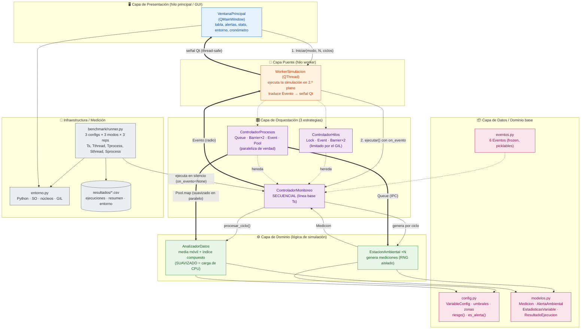

# Diagramas del Sistema de Monitoreo Ambiental Urbano (Cuenca)

Este documento contiene dos vistas del sistema:

1. **Diagrama de clases** — las clases del proyecto, sus atributos/métodos y relaciones.
2. **Diagrama de arquitectura** — las capas del sistema y el flujo de datos en tiempo de ejecución.

> Los diagramas usan [Mermaid](https://mermaid.js.org/). GitHub los renderiza automáticamente.

---

## 1. Diagrama de clases

### Notas del diagrama de clases

- **Herencia:** `ControladorHilos` y `ControladorProcesos` extienden a `ControladorMonitoreo` (que es a la vez la versión secuencial y la clase base). Solo redefinen `MODO` y `ejecutar()`; reutilizan `_evaluar_alertas`, `_construir_resultado` y `_emitir`.
- **Composición (`*--`):** el controlador *posee* sus estaciones y su analizador (su ciclo de vida depende de él).
- **Dependencia (`..>`):** "usa / crea / consume" sin poseer. Las estaciones *crean* mediciones, el analizador las *consume*, etc.
- **`<<frozen dataclass>>`:** objetos inmutables y picklables — clave para cruzar fronteras de hilos/procesos sin condiciones de carrera.

---

## 2. Diagrama de arquitectura

### Flujo de ejecución (resumen)

1. **Inicio:** el usuario elige modo/parámetros en `VentanaPrincipal` y pulsa *Iniciar*.
2. **Aislamiento de hilo:** se lanza `WorkerSimulacion` (un `QThread`) para no congelar la interfaz; este instancia el controlador del modo elegido con `on_evento=self._emitir`.
3. **Simulación por ciclos:** el controlador coordina las `EstacionAmbiental` (generación) y el `AnalizadorDatos` (procesamiento con carga de CPU).
   - **Hilos:** estaciones en `Thread`, buffer compartido protegido con `Lock`, sincronización con `Barrier`/`Event`. El GIL impide acelerar el cómputo.
   - **Procesos:** estaciones en `Process` que envían datos por `Queue`; el suavizado pesado se reparte en un `Pool` → **aceleramiento real (~4×)**.
4. **Eventos de vuelta:** cada hecho relevante viaja como `Evento` → el worker lo convierte en **señal Qt thread-safe** → los handlers actualizan los widgets **solo en el hilo principal**.
5. **Medición (paralela al uso interactivo):** `benchmark/runner.py` ejecuta los controladores **sin GUI** (`on_evento=None`), calcula `Ts / Tthread / Tprocess` y los aceleramientos, y los persiste en `resultados/*.csv`.
