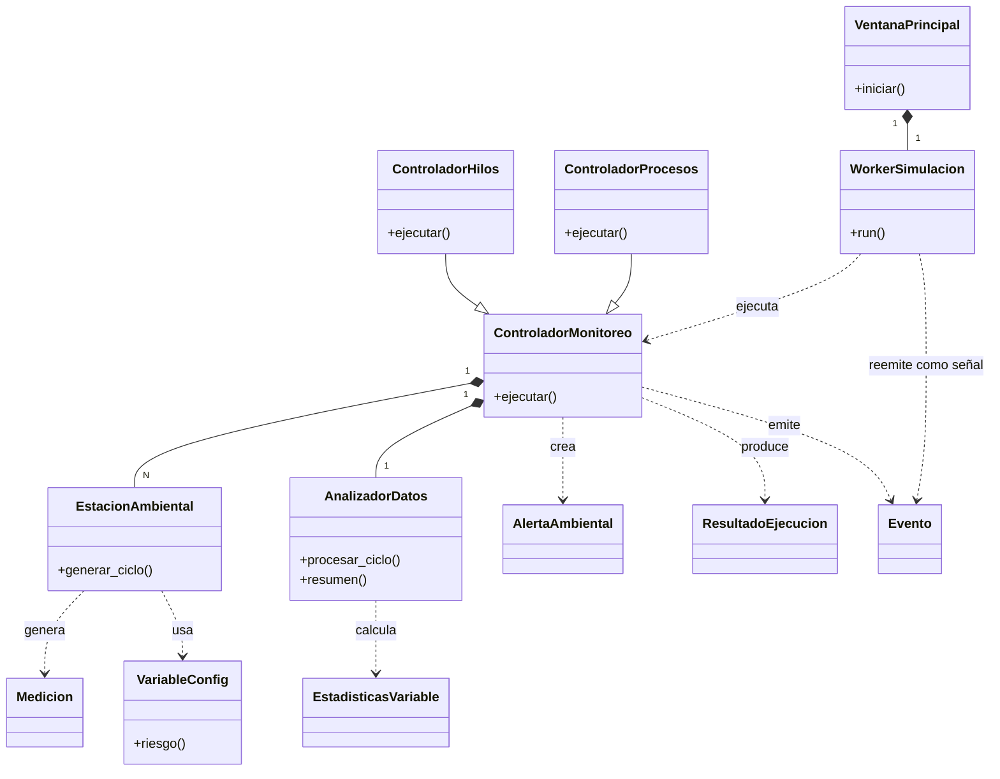

# Diagrama de clases (resumido)

Versión compacta sin atributos, pensada para captura en el informe y la presentación.

**Leyenda:** `--|>` herencia · `*--` composición · `..>` dependencia (crea/usa/emite).
