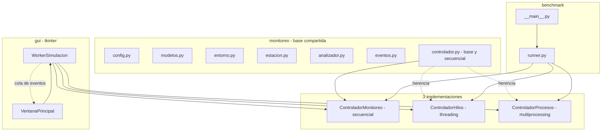
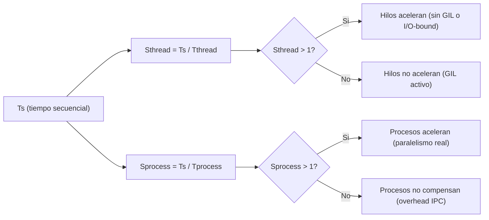

# Practica 4 - Sistema de monitoreo ambiental urbano

Simulacion de un sistema de monitoreo ambiental para la ciudad de Cuenca. Estaciones distribuidas por zonas urbanas generan mediciones periodicas de variables ambientales (temperatura, humedad, ruido, CO2, PM2.5, PM10). Un controlador central recolecta los datos, un analizador procesa estadisticas e indices ambientales, se generan alertas al superar umbrales y una GUI visualiza todo en tiempo real.

El sistema implementa tres modelos de ejecucion: secuencial, hilos y
procesos, con un benchmark que los compara. Esta pensado para ejecutarse
sobre una build **free-threading (sin GIL)** de Python, de modo que la
version por hilos pueda paralelizar de verdad la carga de CPU.

## Requisitos

- Python **3.14t** (build free-threading, sin GIL). Tambien sirve 3.13t.
- Sin dependencias externas: la GUI usa **tkinter** (stdlib).

Instalacion del interprete free-threaded con `uv` (recomendado):

```bash
uv python install 3.14t
uv sync            # crea el entorno desde .python-version (3.14t), sin dependencias
```

Alternativa manual con el interprete free-threaded ya instalado:

```bash
python3.14t -m venv .venv
source .venv/bin/activate
```

## Estructura del proyecto

```
monitoreo/              paquete base compartido por las 3 versiones
  config.py             variables ambientales, rangos, umbrales, zonas
  modelos.py            Medicion, AlertaAmbiental, EstadisticasVariable, ResultadoEjecucion
  entorno.py            info de Python, SO, nucleos y GIL
  estacion.py           EstacionAmbiental y creacion de estaciones
  analizador.py         AnalizadorDatos con la carga de CPU del sistema
  eventos.py            eventos tipados para la GUI
  controlador.py        ControladorMonitoreo (base + secuencial)
  controlador_hilos.py  ControladorHilos (threading + ThreadPool)
  controlador_procesos.py  ControladorProcesos (multiprocessing + Pool)
  __init__.py

benchmark/              motor de benchmarking
  runner.py             ejecucion, metricas y CSV
  __main__.py           CLI: python -m benchmark

gui/                    interfaz grafica con tkinter
  estilo.py             paleta ambiental y estilos ttk
  worker_simulacion.py  hilo puente entre controlador y GUI (cola de eventos)
  ventana_principal.py  ventana principal con todos los paneles
  __main__.py           CLI: python -m gui

resultados/             CSV generados por el benchmark
```

## Ejecucion

En la build free-threading el GIL ya esta apagado por defecto; el
`PYTHON_GIL=0` se incluye por seguridad para que ninguna extension lo
reactive.

### GUI

```bash
PYTHON_GIL=0 python3.14t -m gui
```

Muestra en tiempo real: tabla de estaciones con estado, ultima medicion, alertas activas coloreadas por severidad, estadisticas, informacion del entorno (incluido el estado del GIL) y cronometro. La simulacion corre en un hilo aparte mediante `WorkerSimulacion` (`threading.Thread`), que publica los eventos en una `queue.Queue` que la ventana drena con `root.after()`, por lo que la GUI no se congela.

### Benchmark

```bash
PYTHON_GIL=0 python3.14t -m benchmark
PYTHON_GIL=0 python3.14t -m benchmark --configuraciones 4x10,8x20,12x30 --repeticiones 3 --intensidad 12000
PYTHON_GIL=0 python3.14t -m benchmark --modo secuencial --configuraciones 4x10 --repeticiones 1
```

Opciones:

| Opcion | Descripcion | Default |
|--------|-------------|---------|
| `--configuraciones` | tamanos `NxM` separados por coma | `4x10,8x20,12x30` |
| `--repeticiones` | veces que se ejecuta cada version por configuracion | `3` |
| `--intensidad` | pasadas de suavizado del analizador | `2000` |
| `--ventana` | ventana de la media movil | `10` |
| `--modo` | `secuencial`, `hilos` o `procesos` | todos |
| `--salida` | directorio de los CSV | `resultados` |
| `--no-csv` | solo consola | - |

Salida en `resultados/`:

- `ejecuciones.csv`: una fila por ejecucion individual.
- `resumen.csv`: `Ts`, `Tthread`, `Tprocess`, `Sthread = Ts / Tthread`,
  `Sprocess = Ts / Tprocess` por configuracion.
- `entorno.csv`: version de Python, SO, nucleos y estado del GIL.

### Version MPI (memoria distribuida, practica 5)

El paquete `mpi_monitoreo/` agrega una version paralela con **mpi4py** bajo modelo **SPMD**, pensada para correr en un cluster de varias computadoras. Las estaciones se reparten por dominio entre los procesos MPI (cada rank simula su lote con memoria local) y los resultados se consolidan en el rank 0.

Requiere `mpi4py` + `numpy` + una implementacion de MPI (Open MPI). Se instalan
con `uv sync`.

Ejecucion local (un solo equipo, varios procesos):

```bash
mpiexec -n 1 python -m mpi_monitoreo.practica_mpi --estaciones 12 --ciclos 30 --intensidad 4000 --secuencial
mpiexec -n 2 python -m mpi_monitoreo.practica_mpi --estaciones 12 --ciclos 30 --intensidad 4000 --secuencial
mpiexec -n 4 python -m mpi_monitoreo.practica_mpi --estaciones 12 --ciclos 30 --intensidad 4000 --secuencial
```

Ejecucion en cluster (varios nodos via `hosts.txt`):

```bash
mpiexec -n 4 -hostfile hosts.txt python -m mpi_monitoreo.practica_mpi \
    --estaciones 12 --ciclos 30 --intensidad 4000 --secuencial
```

Opciones: `--estaciones`, `--ciclos`, `--intensidad`, `--ventana`, `--semilla`, `--secuencial` (corre la referencia Ts en rank 0 y calcula `S = Ts / Tp`), `--salida`, `--no-csv`.

Comunicacion MPI utilizada:

| Operacion | Tipo | Uso |
|-----------|------|-----|
| `bcast` | colectiva | difunde los parametros de simulacion |
| `scatter` | colectiva | reparte las estaciones a cada rank |
| `isend` / `recv` | punto a punto | los workers envian sus alertas al rank 0 |
| `gather` | colectiva | el rank 0 reune los agregados parciales |
| `Reduce` | colectiva | suma de control sobre buffer numpy |
| `Barrier` + `Wtime` | colectiva | acota la region cronometrada (Tp) |

Salida en `resultados/mpi.csv`: `num_procesos`, tamano, `tiempo_secuencial`, `tiempo_paralelo`, `speedup`, `eficiencia`, `mediciones_por_segundo`.

## Arquitectura



### Clases principales

| Clase | Responsabilidad |
|-------|-----------------|
| `VariableConfig` | parametros de una variable ambiental (media, desviacion, umbrales) |
| `Medicion` | lectura de una estacion (estacion, zona, variable, valor, ciclo, tiempo) |
| `AlertaAmbiental` | alerta al superar un umbral (variable, valor, umbral, severidad) |
| `EstacionAmbiental` | genera mediciones simuladas con `random.gauss` por variable |
| `AnalizadorDatos` | estadisticas, media movil, indice ambiental compuesto, analisis por bloques |
| `ControladorMonitoreo` | orquesta estaciones, analizador, alertas y mide tiempos |
| `ResultadoEjecucion` | salida estandarizada de cualquier version |
| `WorkerSimulacion` | hilo que ejecuta la simulacion y publica eventos en una cola |

### Carga de CPU y el GIL

`AnalizadorDatos` esta escrito en Python puro sin numpy. El indice ambiental compuesto aplica `intensidad` pasadas de suavizado sobre un tensor de riesgos, y ese trabajo se reparte en bloques tanto en la version por hilos (`ThreadPool`) como en la de procesos (`Pool`).

- **Con GIL** (CPython estandar): solo un hilo ejecuta bytecode a la vez, asi que la version por hilos **no acelera** la numerica; la de procesos si, porque cada proceso tiene su propio interprete.
- **Sin GIL** (build free-threading): el **mismo codigo** de hilos pasa a aprovechar varios nucleos y acelera de verdad.

Ejecutar el benchmark con `intensidad` alta sobre 3.14t evidencia ese salto en `Sthread`, que es el objetivo del experimento.

## Configuracion de variables

| Variable | Unidad | Media | Desviacion | Umbral min | Umbral max |
|----------|--------|-------|------------|------------|------------|
| temperatura | C | 14.0 | 3.5 | 2.0 | 22.0 |
| humedad | % | 72.0 | 8.0 | 40.0 | 92.0 |
| ruido | dB | 55.0 | 12.0 | - | 80.0 |
| co2 | ppm | 420.0 | 25.0 | - | 470.0 |
| pm25 | ug/m3 | 18.0 | 7.0 | - | 30.0 |
| pm10 | ug/m3 | 28.0 | 10.0 | - | 48.0 |

Zonas disponibles: Centro Historico, San Blas, San Sebastian, El Sagrario, El Vecino, Banos, Monay, Yanuncay, Tomebamba, Los Eucaliptos, Sayausi, Nulti.

## Metricas del benchmark


