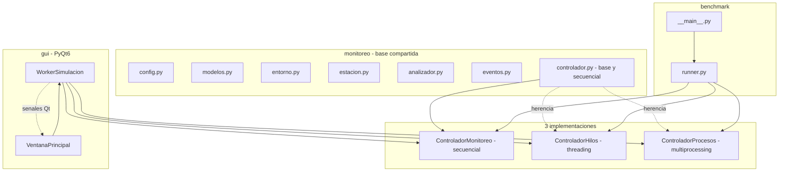
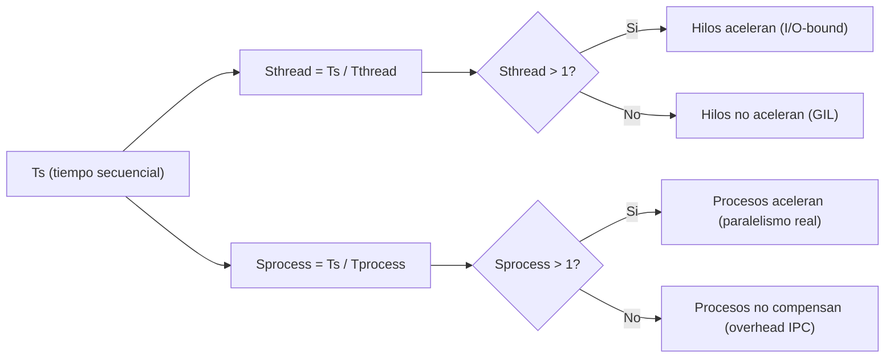

# Practica 4 - Sistema de monitoreo ambiental urbano

Simulacion de un sistema de monitoreo ambiental para la ciudad de Cuenca. Estaciones distribuidas por zonas urbanas generan mediciones periodicas de variables ambientales (temperatura, humedad, ruido, CO2, PM2.5, PM10). Un controlador central recolecta los datos, un analizador procesa estadisticas e indices ambientales, se generan alertas al superar umbrales y una GUI visualiza todo en tiempo real.

El sistema implementa tres modelos de ejecucion: secuencial, hilos y
procesos, con un benchmark que los compara.

## Requisitos

- Python >= 3.12
- PyQt6 para la GUI
Instalacion recomendada con entorno virtual:

```bash
python3 -m venv .venv
source .venv/bin/activate
python -m pip install --upgrade pip
python -m pip install -e .
```

Opcionalmente, si se usa `uv`:

```bash
uv sync
```

## Estructura del proyecto

```
monitoreo/              paquete base compartido por las 3 versiones
  config.py             variables ambientales, rangos, umbrales, zonas
  modelos.py            Medicion, AlertaAmbiental, EstadisticasVariable, ResultadoEjecucion
  entorno.py            info de Python, SO, nucleos y GIL
  estacion.py           EstacionAmbiental y creacion de estaciones
  analizador.py         AnalizadorDatos con la carga de CPU del sistema
  eventos.py            eventos tipados para la GUI
  controlador.py        ControladorMonitoreo (base + secuencial)
  controlador_hilos.py  ControladorHilos
  controlador_procesos.py  ControladorProcesos
  __init__.py

benchmark/              motor de benchmarking
  runner.py             ejecucion, metricas y CSV
  __main__.py           CLI: python -m benchmark

gui/                    interfaz grafica con PyQt6
  estilo.py             paleta ambiental y hoja QSS
  worker_simulacion.py  QThread puente entre controlador y GUI
  ventana_principal.py  ventana principal con todos los paneles
  __main__.py           CLI: python -m gui

resultados/             CSV generados por el benchmark
```

## Ejecucion

### Benchmark

```bash
python -m benchmark
python -m benchmark --configuraciones 4x10,8x20,12x30 --repeticiones 3 --intensidad 2000
python -m benchmark --modo secuencial --configuraciones 4x10 --repeticiones 1
```

Opciones:

| Opcion | Descripcion | Default |
|--------|-------------|---------|
| `--configuraciones` | tamanos `NxM` separados por coma | `4x10,8x20,12x30` |
| `--repeticiones` | veces que se ejecuta cada version por configuracion | `3` |
| `--intensidad` | pasadas de suavizado del analizador | `2000` |
| `--ventana` | ventana de la media movil | `10` |
| `--modo` | `secuencial`, `hilos` o `procesos` | todos |
| `--salida` | directorio de los CSV | `resultados` |
| `--no-csv` | solo consola | - |

Salida en `resultados/`:

- `ejecuciones.csv`: una fila por ejecucion individual.
- `resumen.csv`: `Ts`, `Tthread`, `Tprocess`, `Sthread = Ts / Tthread`,
  `Sprocess = Ts / Tprocess` por configuracion.
- `entorno.csv`: version de Python, SO, nucleos y estado del GIL.

### GUI

```bash
python -m gui
```

Muestra en tiempo real: tabla de estaciones con estado, ultima medicion, alertas activas coloreadas por severidad, estadisticas, informacion del entorno y cronometro. La simulacion corre en un hilo aparte mediante `WorkerSimulacion` (QThread) que emite senales Qt, por lo que la GUI no se congela.

## Arquitectura



### Clases principales

| Clase | Responsabilidad |
|-------|-----------------|
| `VariableConfig` | parametros de una variable ambiental (media, desviacion, umbrales, peso) |
| `Medicion` | lectura de una estacion (estacion, zona, variable, valor, ciclo, tiempo) |
| `AlertaAmbiental` | alerta al superar un umbral (variable, valor, umbral, severidad) |
| `EstacionAmbiental` | genera mediciones simuladas con `random.gauss` por variable |
| `AnalizadorDatos` | estadisticas, media movil, indice ambiental compuesto, analisis por bloques |
| `ControladorMonitoreo` | orquesta estaciones, analizador, alertas y mide tiempos |
| `ResultadoEjecucion` | salida estandarizada de cualquier version |
| `WorkerSimulacion` | QThread que ejecuta la simulacion y emite senales Qt |

### Carga de CPU

`AnalizadorDatos` esta escrito en Python puro sin numpy. El indice ambiental compuesto aplica `intensidad` pasadas de suavizado sobre un tensor de riesgos. Al mantener el GIL durante toda la numerica, la version por hilos no puede paralelizar esta carga, mientras que la version por procesos si puede distribuirla. Esa es la comparacion que el benchmark evidencia.

## Configuracion de variables

| Variable | Unidad | Media | Desviacion | Umbral min | Umbral max | Peso |
|----------|--------|-------|------------|------------|------------|------|
| temperatura | C | 14.0 | 3.5 | 2.0 | 22.0 | 0.15 |
| humedad | % | 72.0 | 8.0 | 40.0 | 92.0 | 0.10 |
| ruido | dB | 55.0 | 12.0 | - | 80.0 | 0.20 |
| co2 | ppm | 420.0 | 25.0 | - | 470.0 | 0.15 |
| pm25 | ug/m3 | 18.0 | 7.0 | - | 30.0 | 0.25 |
| pm10 | ug/m3 | 28.0 | 10.0 | - | 48.0 | 0.15 |

Zonas disponibles: Centro Historico, San Blas, San Sebastian, El Sagrario, El Vecino, Banos, Monay, Yanuncay, Tomebamba, Los Eucaliptos, Sayausi, Nulti.

## Metricas del benchmark


